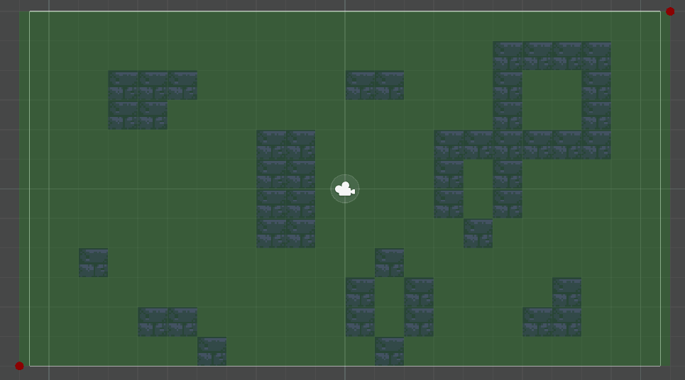

# A* Pathfinding - Unity 2D

This project presents a Unity implementation of the A* algorithm for pathfinding. Utilizing a grid composed of nodes, the algorithm calculates optimal paths from a start point to a designated goal.

The project also includes a custom grid generation tool allows users to define the grid area, considering obstacles or walls marked within unity's tilemap system.

## Table of contents
- [How to use](#how-to-use)
    - [Grid creation](#grid-creation)
    - [Pathfinding](#pathfinding)
- [License](#license)


## How to use

### Grid creation
Add a `GridManager` prefab to the scene. It can found it in the `Prefabs` folder inside `Assets`.

This GameObject contains a script, `GridManager`, where you can specify the size of the grid nodes, the layer that indicates which tiles are considerer walls/obstacles, and a checkbox to toggle grid drawing in the Scene window.

This GameObject also has two child representing opposites corners of the area the grid will cover. During Edit Mode, we can adjust the size of this area by repositioning these objects. Once in Play Mode, the grid will be created, and it won't be able to modify the area anymore.




### Pathfinding
After creating the grid with our GridManager, we can obtain the path between two points within it using the static class `AStarPathfinding`.

To do this we use the `GetPath` function, which requires the initial and the final nodes, as well as the grid we've created.

```CSharp
public class Demo : Monobehaviour
{
    public Transform target;
    private List<Node> _path;

    ...

    private void UpdatePath()
    {
        Node startNode = GridManager.Instance.Grid.GetNode(transform.position);
        Node finalNode = GridManager.Instance.Grid.GetNode(target.position);

        _path = AStarPathfinding.GetPath(
            startNode,
            finalNode,
            GridManager.Instance.Grid);

        ...
    }
}

```

## License
This project is released under the MIT License by Diego Ruiz Gil (2024)
